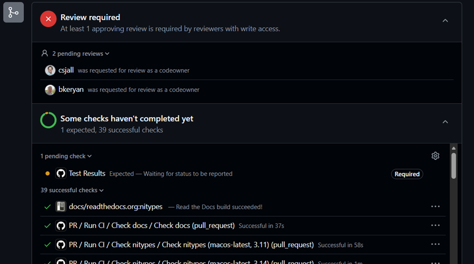

# Contributing to `nitypes`

Contributions to `nitypes` are welcome from all!

`nitypes` is managed via [git](https://git-scm.com), with the canonical upstream
repository hosted on [GitHub](https://github.com/ni/nitypes-python/).

`nitypes` follows a pull-request model for development.  If you wish to
contribute, you will need to create a GitHub account, fork this project, push a
branch with your changes to your project, and then submit a pull request.

## Signing Off Commits

Please remember to sign off your commits (e.g., by using `git commit -s` if you
are using the command line client). This amends your git commit message with a line
of the form `Signed-off-by: Name Lastname <name.lastmail@emailaddress.com>`. Please
include all authors of any given commit into the commit message with a
`Signed-off-by` line. This indicates that you have read and signed the Developer
Certificate of Origin (see below) and are able to legally submit your code to
this repository.

See [GitHub's official documentation](https://help.github.com/articles/using-pull-requests/) for more details.

# Getting Started

To contribute to this project, it is recommended that you follow these steps:

1. Ensure you have [python](https://www.python.org) version 3.11.9 or newer [installed](https://www.python.org/downloads/).
1. Ensure you have [poetry](https://python-poetry.org/)
   version 2.1.3 or newer [installed](https://python-poetry.org/docs/#installation).
1. Fork the repository on GitHub.
1. Install `nitypes` dependencies using `poetry install --with docs`.
1. Run the regression tests and the static analysis checks on your system
   (see [Testing](#testing) and [Static Analysis](#static-analysis) sections).
   If regression tests and static analysis checks all pass, proceed to the next step.
   If you encounter any failures do not begin development.
   Try to investigate these failures. If you're unable to resolve the failures, report an
   issue through our [GitHub issues page](http://github.com/ni/nitypes-python/issues).
1. If you intend to make any changes that will affect the documentation generated from the code,
   review relevant portions of the documentation. You can open generated documentation by
   running the following command from the distribution root: `start docs\_build\index.html`.
1. Write new tests that demonstrate your bug or feature. Ensure that these new tests fail.
1. Make your change. Remember to sign off your commits as described [above](#signing-off-commits).
1. Run all the regression tests again (including the tests you just added.
   If there are any failures, fix them by changing the code or the test, as appropriate, before
   moving to the next step.
1. Perform all the static analysis checks per [Static Analysis](#static-analysis) section below.
1. Review documentation generated from code.
1. Send a GitHub Pull Request to the main repository's `main` branch. GitHub Pull Requests are the
   expected method of code collaboration on this project.
1. Look at the checks on the checks on the Conversation tab in the PR. If all checks pass, that
   portion of the PR page should look similar to this:
   
   Note that the `Test Results` check will not complete due to a known issue.

   If any of the checks fails, attempt to fix the failures by changing the code.

# Testing

In order to be able to run the `nitypes` regression tests, your setup should meet the following minimum
requirements:

- Machine has a supported version of CPython or PyPy installed.
- Machine has [poetry](https://python-poetry.org/) installed.

Run each of the following commands in the root of the distribution.

1. Run `poetry run pytest -v` to run regression tests.
1. Perform benchmark test.
   * For the first run, prior to making any changes, run the
   command `poetry run pytest -v tests/benchmark --benchmark-save=base`
   * For the second and subsequent runs, after making changes, run the
   command `poetry run pytest -v tests/benchmark --benchmark-compare=0001`

   To learn more about benchmark tests, refer
   to https://pytest-benchmark.readthedocs.io/en/latest/comparing.html

# Static Analysis

Static analysis is performed in several steps, as set forth below. Run each of the commands listed below in the root of the distribution.

1. Run `poetry run ni-python-styleguide lint` to check that the updated code follows NI's Python
   coding conventions. If this reports errors, first run `poetry run ni-python-styleguide fix`
   to sort imports and format the code with Black, then manually fix any ring errors.
1. Run `poetry run mypy`. If there are any failures, fix them.
1. Run `poetry run pyright`. If there are any failures, fix them.
1. Run `poetry run bandit -c pyproject.toml -r src/nitypes`. If there are any failures, fix them.
1. Run `poetry run sphinx-build docs docs/_build --builder html --fail-on-warning` to
   generate documentation. If there are any failures, fix them.

# Example Development Workflow

```
# Create a fork
# Create a new branch
git fetch
git switch --create users/{username}/{branch-purpose} origin/main

# Install the project dependencies
poetry install --with docs

# Run the tests
poetry run pytest -v
poetry run pytest -v tests/benchmark --benchmark-save=base

# Run the analyzers and generate documentation
poetry run nps lint
poetry run mypy
poetry run pyright
poetry run bandit -c pyproject.toml -r src/nitypes
poetry run sphinx-build docs docs/_build --builder html --fail-on-warning

# Review generated documentation
start docs\_build\index.html

# ✍ Make source changes
# Remember to sign off commits

# Run the tests
poetry run pytest -v
poetry run pytest -v tests/benchmark --benchmark-compare=0001

# Run the analyzers and generate documentation
poetry run nps lint
poetry run mypy
poetry run pyright
poetry run bandit -c pyproject.toml -r src/nitypes
poetry run sphinx-build docs docs/_build --builder html --fail-on-warning

# Review generated documentation
start docs\_build\index.html
```

# Publishing on PyPI

You can publish the `nitypes` package by creating a GitHub release
in the `nitypes-python` repo. Here are the steps to follow to publish the package:

1. From the main GitHub repo page, select "Create a new release".
2. On the "New Release" page, create a new tag using the "Select Tag" drop down. The tag must be the package version, matching the
value found in pyproject.toml. Example: `0.1.0-dev0`.
3. Enter a title in the "Release title" field. The title should contain the package name and
version in the format `nitypes <package-version>`. For example: `nitypes 0.1.0-dev0`.
4. Click "Generate release notes" and edit the release notes.
  - Delete entries for PRs that do not affect users, such as "chore(deps):" and "fix(deps):" PRs.
  - Consider grouping related entries.
  - Reformat entries to be more readable. For example, change "Blah blah by so-and-so in \#123" to "Blah blah (\#123)".
5. If this is a pre-release release, check the "Set as a pre-release" checkbox.
6. Click "Publish release".
7. Creating a release will start the publish workflow. You can track the
progress of this workflow in the "Actions" page of the GitHub repo.
8. The workflow job that publishes a package to PyPI requires code owner approval. This job will automatically send code owners a notification email, then it will wait for them to log in and approve the deployment.
9. After receiving code owner approval, the publish workflow will resume.
10. Once the publish workflow has finished, you should see your release on PyPI.

# Developer Certificate of Origin (DCO)

   Developer's Certificate of Origin 1.1

   By making a contribution to this project, I certify that:

   (a) The contribution was created in whole or in part by me and I
       have the right to submit it under the open source license
       indicated in the file; or

   (b) The contribution is based upon previous work that, to the best
       of my knowledge, is covered under an appropriate open source
       license and I have the right under that license to submit that
       work with modifications, whether created in whole or in part
       by me, under the same open source license (unless I am
       permitted to submit under a different license), as indicated
       in the file; or

   (c) The contribution was provided directly to me by some other
       person who certified (a), (b) or (c) and I have not modified
       it.

   (d) I understand and agree that this project and the contribution
       are public and that a record of the contribution (including all
       personal information I submit with it, including my sign-off) is
       maintained indefinitely and may be redistributed consistent with
       this project or the open source license(s) involved.

(taken from [developercertificate.org](https://developercertificate.org/))

See [LICENSE](https://github.com/ni/nitypes-python/blob/main/LICENSE)
for details about how `nitypes` is licensed.
